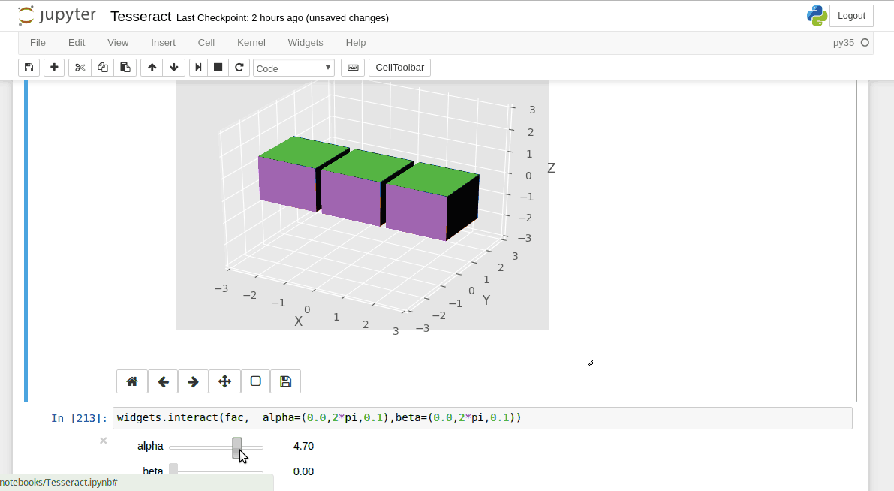

# Tesseract

This is a proof-of-concept visualization of a 4d blocksworld game. A player in the 4d world would only be able to see a 3d slice of it at a time (much like a 2d being could only comprehend one 2d slice of the 3d reality at a time, that is, a plane). In a MineCraft-like game, this means that a literal additional dimension is added to the game, which allows for novel complex interaction among the players and between the players and the world. For example, mazes can be constructed that require  intricate understanding of 4d geometry to navigate them.

The script visualizes a grid of 4d cubes (tesseracts https://en.wikipedia.org/wiki/Tesseract). A 3d slice of the 4d reality is computed at each frame to show to the player). The 3d slice is further projected down to the 2d screen using a classical graphics engine. To play with the visualization simply execute the Tesseract_tidy.ipynb notebook (you'll need jupyter installed).

The ultimate vision for the project is to rewrite it as a full-fledged app. This would require writing custom GPU shaders for efficient rendering of the 4d structures.

## References

Check out a wonderful explanation of 4d concepts at http://hi.gher.space/classic/page8.html and an actual 4d game in developement at https://www.youtube.com/watch?v=9yW--eQaA2I&t=24s.

## Example

The example shows a grid of 9 tesseract blocks rotating on two different axes around the 4th dimension (xw and yw axes; keep in mind that the axis of a 4d rotation is a plane, not a line).  When we rotate around the 4d dimension, the tesseracts appear to change the shape because the 3d slice that wee see is no longer aligned with the tesseract (similarly, if we rotated a plane that is slicing a cube, the intersection could be of a shape other than a rectangle). The tesseracts also appear to pop in an out of existence (and we never see all 9 tesseracts in this example). This is because the 3d slice that we see does not intersect all of the tesseracts at all times. In a 4d game, a player would never be able to see everything around at once - the player would need to "look around" and check all 4 dimensions to make sure nothing is hiding there.

